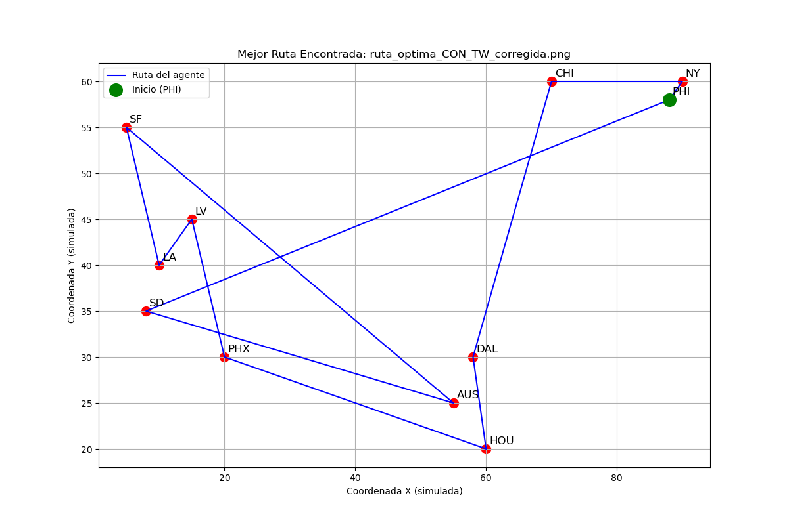
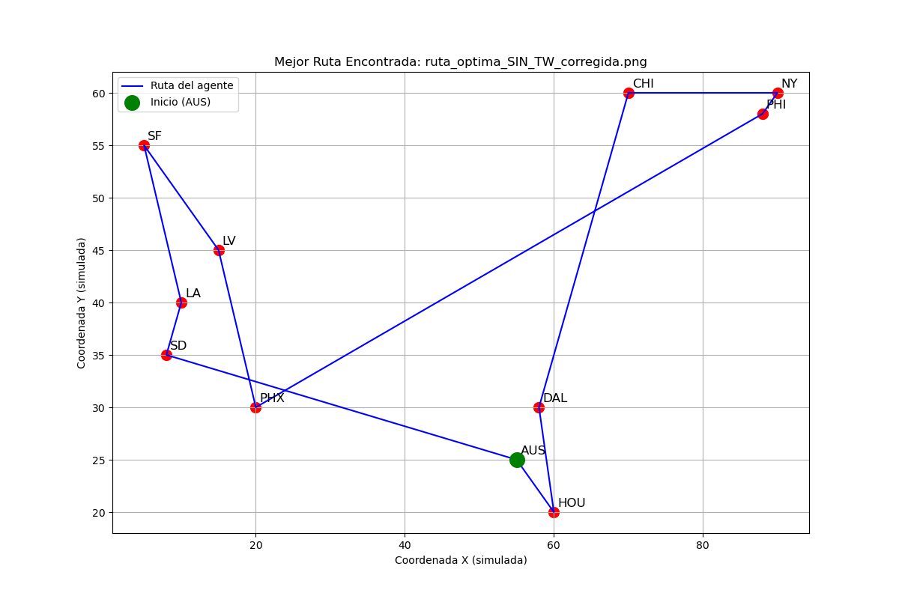

# Implementación de un Algoritmo Genético Híbrido para TSP-TW

[](https://www.python.org/)
[](https://pypi.org/project/numpy/)

Este repositorio contiene mi implementación de un **Algoritmo Genético Híbrido (HGA)** diseñado para resolver el Problema del Agente Viajero (TSP) y su variante más compleja, el Problema del Agente Viajero con Ventanas de Tiempo (TSP-TW).

## 🎯 El Problema: TSP y TSP-TW

El objetivo es encontrar la ruta de menor costo que visita un conjunto de ciudades una sola vez y regresa al origen. Este proyecto aborda dos versiones:

1.  **TSP Simple:** El problema clásico, donde solo se busca minimizar la distancia total.
2.  **TSP-TW (Time Windows):** Una variante mucho más compleja donde cada ciudad tiene una "ventana de tiempo" (un intervalo [inicio, fin]) en la que debe ser visitada. Si el agente llega antes, debe esperar. Si llega después, se aplica una fuerte penalización.

## 🛠️ Arquitectura de la Solución

Para resolver este problema (que es de tipo NP-duro), diseñé un Algoritmo Genético Híbrido que combina la exploración global de los algoritmos evolutivos con la explotación local de las heurísticas.

### Componentes Clave

* **Algoritmo Genético (GA):** Es el núcleo delB programa. Mantiene una población de rutas (individuos) que evoluciona a lo largo de las generaciones para encontrar mejores soluciones.
* **Función de Aptitud (Fitness Function):**
    * Para **TSP Simple**, la aptitud es simplemente el costo total de la ruta.
    * Para **TSP-TW**, la aptitud es una función de costo penalizada. Calculé el tiempo de llegada a cada ciudad, forzando esperas si se llega antes de la ventana. Si el tiempo de llegada excede el final de la ventana, se aplica una penalización cuadrática (`lambda_pen * (tiempo_llegada - fin_ventana)**2`) para desalentar fuertemente las soluciones inválidas.
* **Operador de Cruce: Cycle Crossover (CX)**
    * Seleccioné el operador CX porque está diseñado específicamente para problemas de permutación como el TSP. Garantiza que todos los descendientes ("hijos") sean rutas válidas que contienen cada ciudad exactamente una vez, sin necesidad de reparaciones.
* **Heurística de Búsqueda Local: Remoción de Abruptos (Corregida)**
    * Esta es la parte "híbrida" del algoritmo y la clave para su alto rendimiento. Después de crear un descendiente, esta heurística lo refina.
    * **Funcionamiento:** Itera sobre cada ciudad de la ruta y la "remueve" temporalmente. Luego, prueba reinsertarla en una nueva posición (antes y después) cerca de sus `m` ciudades más cercanas. Si alguna de estas inserciones resulta en una ruta con *mejor* aptitud (menor costo/penalización), se acepta el cambio. Este proceso pule las soluciones eliminando "abruptos" o conexiones ineficientes.

## ⚙️ Dependencias

Esta implementación utiliza dos bibliotecas estándar de Python para el análisis numérico y la visualización:

* `numpy`: Para el manejo eficiente de la matriz de costos.
* `matplotlib`: Para generar las gráficas de las rutas óptimas.

Puedes instalarlas fácilmente usando `pip`:
```bash
pip install numpy matplotlib
```

## 🚀 Cómo Ejecutar

1.  Clona o descarga este repositorio.
2.  Asegúrate de tener las dependencias instaladas.
3.  Ejecuta el script de Python desde tu terminal:

```bash
python nombre_del_script.py
```

El script está configurado para ejecutar `N_CORRIDAS` (5 por defecto) para cada uno de los dos experimentos (CON y SIN ventanas de tiempo).

## 📊 Resultados Esperados

Al ejecutar el script, verás en la consola la salida del progreso y las estadísticas finales de las corridas.

### 1. Salida en Consola

Se mostrará el progreso y, al final, un resumen estadístico para cada experimento:
```
📊 ESTADÍSTICAS CON VENTANAS:
  Mejor:      320.50
  Promedio:   325.10
  Peor:       330.00
  Desv. Est:  4.75
  Mejor Ruta Global: NY → PHI → CHI → HOU → DAL → ...

📊 ESTADÍSTICAS SIN VENTANAS:
  Mejor:      240.15
  Promedio:   242.30
  Peor:       245.00
  Desv. Est:  2.10
  Mejor Ruta Global: NY → CHI → PHI → HOU → AUS → ...
```

### 2. Gráficos de Rutas

Además, el script guardará automáticamente dos archivos de imagen (`.png`) en la misma carpeta, mostrando la mejor ruta encontrada para cada experimento.

#### Mejor Ruta (Con Ventanas de Tiempo)
*(Aquí aparecerá la imagen `ruta_optima_CON_TW_corregida.png` después de ejecutar el script)*


#### Mejor Ruta (Sin Ventanas de Tiempo)
*(Aquí aparecerá la imagen `ruta_optima_SIN_TW_corregida.png` después de ejecutar el script)*
